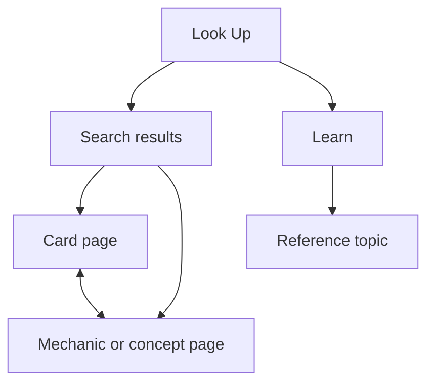

# MTG Helper — V0 Product Specification

**Status:** Ready for implementation planning  
**Version:** 0.1  
**Initial card pool:** *Magic: The Gathering | The Hobbit* (HOB)  
**Primary setting:** Local house games with 2–4 players, including beginners  
**Primary device:** A phone shared or consulted during play

## 1. Product thesis

MTG Helper answers one immediate question:

> “What do I need to understand right now to play this card correctly?”

It is not a simplified copy of the Comprehensive Rules and is not initially a universal Magic rules engine. V0 is a searchable, beginner-oriented scenario guide for *The Hobbit*. It translates authoritative card and rules information into short explanations, examples, common mistakes, and important boundary cases.

## 2. V0 objective

Validate whether beginners will voluntarily use a structured scenario lookup during a real game instead of:

- asking the most experienced player;
- reading and rereading the card without reaching an answer; or
- searching the web and sorting through unrelated results.

### Success signal

After at least three house-game sessions:

- players can find a relevant entry without assistance in most searches;
- a typical lookup takes no more than 30 seconds;
- at least half of real rules questions are answered by existing content;
- players return to the app during later games; and
- unanswered searches provide a clear content backlog.

These are learning targets, not launch-scale analytics requirements.

## 3. Target users

### Primary user

A new or casual player who can read a card but does not yet recognize the rules implications of its wording.

### Secondary user

The experienced player at the table who wants a quick, neutral explanation supported by an official source.

### V0 context

- Two to four players
- In-person house games
- *The Hobbit* cards
- Mobile browser or installed PWA
- Internet may be unreliable once play begins

## 4. Scope

### Included in V0

1. **Global search**
   - Search by card name, mechanic, keyword, or beginner phrase.
   - Tolerate partial names and minor misspellings.
   - Separate results into Cards and Concepts.

2. **Mechanic and concept pages**
   - Plain-English explanation
   - Happy-path example
   - Common mistake
   - Important boundary cases
   - “Can players respond?” guidance where applicable
   - One-line memory aid
   - Expandable official wording and sources
   - Related cards and concepts

3. **Card pages**
   - All 193 mechanically distinct main-set HOB cards are searchable and receive a basic page.
   - Card image and current Oracle text
   - Short “what this card does” summary
   - Linked mechanics and concepts
   - Card-specific scenarios and “easy to miss” guidance for an initial curated group of 20–25 high-confusion cards
   - Official rulings and sources, when available

4. **Compact learn reference**
   - Turn structure
   - Casting and resolving a spell
   - Attacking and blocking
   - Tokens versus counters
   - Targeting
   - Stack and priority at a beginner-appropriate level

5. **Offline support**
   - Application shell and curated V0 content work without a connection after first load.
   - The UI clearly indicates when an image or external source is unavailable offline.

6. **Feedback capture**
   - “Did this answer your question?”
   - “Report something unclear or incorrect.”
   - Log searches with no selected result locally for later review.

### Explicitly excluded from V0

- Arbitrary natural-language rules answers
- AI-generated rulings shown directly to players
- Automatic resolution of any two-card combination
- Coverage of every Hobbit card
- Coverage of all possible edge cases
- Deck building or draft strategy
- Format recommendation questionnaire
- Life counter
- User accounts, synchronization, or social features
- Deck scanning or camera recognition
- Tournament-policy and judge-call replacement

## 5. Content boundary

### Set mechanics

V0 begins with the official mechanics central to *The Hobbit*:

- Storied and enduring story
- Recruit
- Hone counters
- Landfall
- Ferocious
- Amass Goblins

### Supporting evergreen concepts

Only concepts required to understand the initial cards should be added:

- Permanent
- Token
- Counter
- Artifact
- Legendary permanent
- Saga
- Triggered ability
- Static ability
- Activated ability
- Target
- Stack
- Priority and responding
- Resolution
- State-based actions
- Zones
- “This way”
- “And/or”

### Initial scenario-card selection

Import all 193 mechanically distinct cards from the main HOB set for search and basic card pages. Add curated explanations and scenarios to approximately 20–25 cards, selected using this priority order:

1. Cards physically owned or regularly played by the group
2. Cards containing a new set mechanic
3. Cards with official release-note rulings
4. Cards combining two or more relevant concepts
5. Cards that caused a real question during play

Do not select cards merely to represent every color or rarity. The initial set should maximize likely confusion and real use.

## 6. Core user journeys

### Journey A — Look up a card

1. Player opens the app.
2. Search is focused immediately.
3. Player types part of a card name.
4. Matching cards appear with image thumbnail, name, and short identifying text.
5. Player opens a card.
6. The page first shows the beginner summary and “Easy to miss” items.
7. The player expands scenarios or official details only if needed.

### Journey B — Look up a mechanic

1. Player searches “storied.”
2. The mechanic result is visually distinct from card results.
3. The page explains the mechanic in plain English.
4. A simple scenario shows the normal outcome.
5. Boundary scenarios answer whether tokens count, whether one permanent counts twice, when the designation is earned, and whether it can be lost.
6. Related Hobbit cards are available below the explanation.

### Journey C — Search using beginner language

1. Player searches “do treasure tokens count?”
2. Search matches aliases and indexed scenario questions.
3. Results prioritize Storied, Token, and relevant card pages.
4. If nothing useful is selected, the query is stored as an unanswered search.

### Journey D — Check the turn

1. Player opens Learn.
2. Player selects “Turn structure.”
3. The page shows the phases in order with only the actions most relevant to a beginner.
4. Advanced detail is collapsed.

## 7. Information architecture

V0 has two primary destinations:

- **Look Up** — the default home and search experience
- **Learn** — a compact rules reference

A third navigation destination should not be introduced until a later feature justifies it.



## 8. Screen specifications

### 8.1 Look Up / Home

**Required elements**

- Product name
- Prominent search field with placeholder: “Search a card, mechanic, or question”
- Recent searches, stored on device
- “Playing The Hobbit” context label
- Shortcut to Set Mechanics
- Shortcut to Learn the Turn

**Empty-state examples**

- Storied
- Recruit
- Thorin Oakenshield
- Do artifact tokens count?

### 8.2 Search results

**Behavior**

- Update results as the user types.
- Search normalized titles, aliases, card text, scenario questions, and tags.
- Rank exact title matches first.
- Display grouped headings: Mechanics & Concepts, Cards, Scenarios.
- Selecting a scenario opens its parent page and anchors to the relevant scenario.
- Never fabricate an answer when no match exists.

**No-result state**

> “We don’t have an explanation for that yet. Try a card or mechanic name.”

Offer related terms when available and allow the player to save the unanswered question.

### 8.3 Mechanic or concept page

Display in this order:

1. Name and type
2. **In plain English**
3. **Remember this**
4. **Simple example**
5. **Easy to miss**
6. **Scenarios**
7. **Related cards and concepts**
8. **Official wording and sources** — collapsed by default

### 8.4 Card page

Display in this order:

1. Card name, image, mana cost, type line, and current Oracle text
2. **What this card does**
3. **Mechanics on this card**
4. **Easy to miss**
5. **Card-specific scenarios**
6. **Official rulings and sources**

Strategic opinions must not appear in the rules explanation unless explicitly labeled “Play tip.” V0 should generally omit strategy.

### 8.5 Learn topic

- One-screen summary first
- Ordered steps or phase list where relevant
- One example
- Common mistake
- Related concepts
- Optional technical detail

## 9. Scenario content model

Every scenario is a bounded question with a supported answer—not a promise to enumerate every interaction.

### Required fields

```ts
type Scenario = {
  id: string;
  parentConceptIds: string[];
  parentCardIds?: string[];
  title: string;                 // Beginner phrasing
  setup: string[];               // Relevant game state only
  question: string;
  answer: "yes" | "no" | "depends" | "explanation";
  explanation: string;
  outcome?: string[];            // Ordered only when order matters
  canRespond?: string;
  commonMistake?: string;
  tags: string[];
  sourceIds: string[];
  verificationStatus: "draft" | "reviewed" | "verified";
  reviewedAt?: string;
};
```

### Scenario categories

- Happy path
- Common mistake
- Timing and responding
- Counting and qualification
- Zone change
- Losing the source of an effect
- Multiple characteristics
- Tokens and copies
- Resolution and partial completion

Not every entry requires every category.

## 10. Data model

```ts
type Concept = {
  id: string;
  name: string;
  kind:
    | "keyword-ability"
    | "keyword-action"
    | "ability-word"
    | "set-mechanic"
    | "game-concept"
    | "object"
    | "zone";
  aliases: string[];
  summary: string;
  memoryAid: string;
  officialText?: string;
  relatedConceptIds: string[];
  sourceIds: string[];
  verificationStatus: "draft" | "reviewed" | "verified";
};

type Card = {
  id: string;
  oracleId?: string;
  setCode: "HOB";
  collectorNumber: string;
  name: string;
  imageUri?: string;
  manaCost?: string;
  typeLine: string;
  oracleText: string;
  summary: string;
  conceptIds: string[];
  sourceIds: string[];
  verificationStatus: "draft" | "reviewed" | "verified";
};

type Source = {
  id: string;
  title: string;
  publisher: string;
  url: string;
  sourceType:
    | "oracle-text"
    | "comprehensive-rules"
    | "official-ruling"
    | "release-notes"
    | "official-mechanics";
  retrievedAt: string;
  rulesEffectiveDate?: string;
};
```

Relationships are used for navigation, search, and retrieval. They are not an executable rules engine.

## 11. Editorial and verification policy

### Source hierarchy

Use the most direct authoritative source available:

1. Current Oracle card text
2. Current Comprehensive Rules
3. Official card rulings
4. Official set release notes
5. Official mechanics articles

Community explanations may help identify questions but may not be the sole authority for a published V0 answer.

### Content labels

The UI and internal data must distinguish:

- **Official text** — reproduced or linked authoritative wording
- **Official ruling** — a published clarification for a card or mechanic
- **Explanation** — the app’s beginner-friendly paraphrase
- **Scenario** — an illustrative game state derived from supported rules
- **Play tip** — strategic advice, if later introduced

### Verification workflow

1. Draft the explanation from current official sources.
2. Identify each claim that affects the outcome.
3. Connect every outcome claim to at least one source.
4. Review the explanation against the exact Oracle wording.
5. Test the stated scenario step by step.
6. Mark it verified only after review.
7. Store the review date because later rules updates can change conclusions.

Unverified content must not be shipped in the default production dataset.

## 12. Search design

V0 should use deterministic local full-text/fuzzy search rather than an LLM.

### Indexed fields

- Card and concept names
- Aliases and common misspellings
- Oracle text
- Plain-English summaries
- Scenario titles and questions
- Beginner-language tags

### Ranking priority

1. Exact name
2. Name prefix
3. Alias or scenario-question match
4. Summary or tag match
5. Oracle-text match

### Suggested aliases

- “treasure count” → Token, Artifact, Storied
- “respond” → Priority, Stack, Resolution
- “counts twice” → Storied, Multiple characteristics
- “draw discard token” → Recruit
- “equipment counter” → Hone counter

## 13. Technical direction

The implementation uses a static, local-first architecture:

- TanStack Start with React and TypeScript
- TanStack Router with file-based, type-safe routes
- Static prerendering for the known card, mechanic, and learning routes
- Installable PWA using a generated service worker
- Mobile-first responsive interface
- shadcn/ui patterns using Base UI primitives and Tailwind CSS
- Curated content stored as version-controlled TypeScript data and validated with Zod
- MiniSearch index generated locally from the bundled content
- Service-worker precaching of the application shell and curated content
- Local storage for recent and unanswered searches
- No backend required for the first house-game test

TanStack Query, DB, AI, Form, Virtual, and Pacer are intentionally deferred until a concrete remote-data, synchronization, AI, form-complexity, list-scale, or scheduling requirement justifies each package.

A backend becomes justified when the app needs shared feedback, content administration, user accounts, or frequently updated remote data.

### Card images and external data

Do not assume third-party card images may be redistributed or cached indefinitely. Confirm the selected card-data provider’s current image and attribution requirements before implementation. The app must remain usable when images are unavailable.

## 14. Nonfunctional requirements

- Search field becomes usable within two seconds on a typical modern phone after first installation.
- Search results appear within 150 ms for the local V0 dataset.
- Core text content remains usable offline.
- All interactive targets meet mobile touch-size expectations.
- Body text supports browser zoom and dynamic text sizing.
- Color is never the only indication of answer type or status.
- Advanced technical detail is collapsed but keyboard and screen-reader accessible.
- A rules answer always exposes its sources within one additional tap.

## 15. Analytics for the house-game test

V0 does not need surveillance or a hosted analytics platform. Record the following on-device and provide a manual export/reset control:

- Search query
- Whether a result was selected
- Selected result
- Whether the user marked the answer helpful
- Reported unclear or incorrect content
- Timestamp

Do not record player names, decks, or full game state.

## 16. Acceptance criteria

V0 is ready for a house-game test when:

- the PWA installs on a phone;
- core pages work offline after first load;
- search finds entries by exact name, partial name, alias, and selected beginner questions;
- at least six set-mechanic pages are complete;
- at least ten supporting concept pages are complete;
- all 193 main-set Hobbit cards are searchable and have a basic card page;
- at least twenty selected Hobbit cards have curated beginner explanations and scenarios;
- every published card and scenario outcome is marked verified;
- every published outcome has an accessible official source;
- Storied coverage includes tokens, overlapping characteristics, earning the designation, retaining it, and timing/responding;
- Recruit coverage includes resolution as one uninterrupted instruction, land versus nonland discard, and cases where drawing or discarding is modified or impossible;
- hone-counter coverage distinguishes the counter’s rules effect from an ability printed on the Equipment;
- no-result searches can be saved for review; and
- the app can export its local test log.

## 17. Test plan

### Before the first game

- Give a beginner the app without explaining its navigation.
- Ask them to find Storied and explain whether a Treasure token counts.
- Ask them to find a selected card by partial name.
- Ask them what happens during recruit and when another player can respond.

### During games

- Do not prompt players to use the app after the initial introduction.
- Record actual questions separately only when doing so does not interrupt play.
- Allow the app’s normal unanswered-search logging to capture gaps.

### After each game

Review:

- unanswered queries;
- pages that took too long to interpret;
- explanations players still asked someone to clarify;
- card-specific questions incorrectly placed on generic mechanic pages; and
- content that was technically correct but not memorable.

## 18. Immediate implementation backlog

### Milestone 1 — Content foundation

- Import and validate all 193 mechanically distinct main-set cards
- Select the first 20–25 high-confusion cards for scenario coverage
- Create source records for official Hobbit materials and current rules
- Author and verify Storied, Recruit, and hone counters
- Author supporting Token, Permanent, Artifact, Legendary, Saga, Stack, Priority, Resolution, Target, and Counter concepts
- Create the first ten card-specific pages

### Milestone 2 — Functional shell

- Implement Look Up and Learn navigation
- Implement local search and ranking
- Build mechanic, concept, card, and scenario components
- Add source expansion and verification status
- Add recent and unanswered searches

### Milestone 3 — House-game release

- Finish the selected 20–25 cards
- Add offline caching
- Add helpfulness and issue reporting
- Add test-log export and reset
- Run accessibility and mobile checks
- Install on the phones that will be used at the table

## 19. Deferred roadmap

After V0 is validated:

- **V0.5:** broader beginner lessons and additional Hobbit cards
- **V1:** game setup assistance and a minimal 2–4 player counter
- **V1.5:** Pick-Two Draft, Sealed, and prerelease companion modes
- **V2:** retrieval-grounded natural-language questions with citations and explicit uncertainty

## 20. Open decisions before coding

The technical stack and card-coverage strategy are decided. Before the first house-game release, two operational choices remain:

1. Which 20–25 cards should receive the first curated scenario coverage?
2. Which provider should host the first shared deployment?

Neither decision blocks the thin vertical-slice prototype.

## Official starting sources

- [The Hobbit Release Notes](https://magic.wizards.com/en/news/feature/the-hobbit-release-notes)
- [The Hobbit Mechanics](https://magic.wizards.com/en/news/feature/the-hobbit-mechanics)
- [The Hobbit Update Bulletin](https://magic.wizards.com/en/news/announcements/the-hobbit-update-bulletin)
- [The Hobbit Prerelease Guide](https://magic.wizards.com/en/news/feature/the-hobbit-prerelease-guide)
